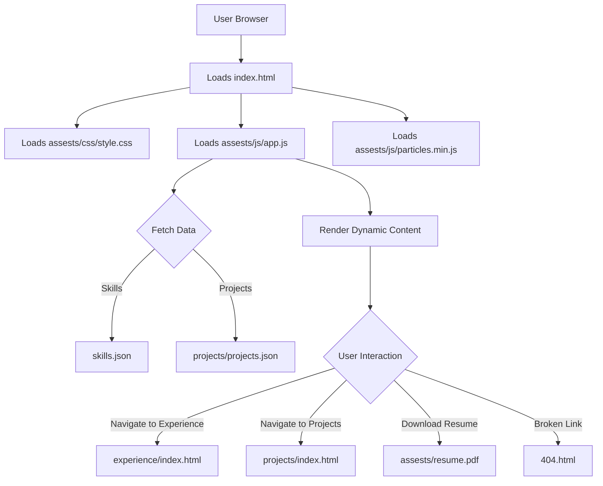

# 🚀 Dynamic Portfolio Website

<p align="center"></p>

## Short Description

Unveiling a meticulously crafted, high-performance personal portfolio website designed to showcase your professional journey, skills, and projects with unparalleled elegance and interactivity. This modern, responsive platform is engineered to make a lasting impression, providing a seamless and engaging experience for visitors exploring your professional capabilities.

## ✨ Key Features

*   **Stunning & Responsive Design:** A visually captivating user interface built with HTML, CSS, and JavaScript, ensuring a flawless experience across all devices.
*   **Comprehensive Professional Showcase:** Dedicated sections for your `Experience`, `Projects`, and `Skills`, offering a structured and detailed overview of your accomplishments.
*   **Interactive Elements:** Leveraging `particles.min.js` and custom JavaScript, the website provides dynamic visual feedback and an engaging user experience.
*   **Downloadable Resume:** Instantly accessible `resume.pdf` for recruiters and collaborators.
*   **Robust CI/CD Pipeline:** Automated deployment and testing via GitHub Actions (`.github/workflows/ci-cd.yml`) ensure code quality and seamless updates.
*   **Custom 404 Page:** A personalized `404.html` with dedicated CSS and JS for a user-friendly error experience.
*   **Organized Asset Management:** Clearly structured `assests` for images, stylesheets, and scripts, promoting maintainability and scalability.

## Who is this for?

This project is ideal for:

*   **Software Developers & Engineers:** To display their coding prowess, project contributions, and technical expertise.
*   **Designers & Creatives:** To exhibit their visual works, user experience designs, and creative processes.
*   **Students & Job Seekers:** To present a professional online resume and a compelling case for their abilities to potential employers.
*   **Freelancers & Consultants:** To market their services and highlight successful past projects.

## Technology Stack & Architecture

This portfolio website is a prime example of a modern, client-side rendered static site, leveraging core web technologies for maximum performance and broad compatibility.

*   **Frontend:** HTML5, CSS3, JavaScript (Vanilla JS, `particles.min.js` for dynamic backgrounds).
*   **Styling:** Custom CSS (`style.css`, `404.css`, `experience/style.css`, `projects/style.css`) for a unique aesthetic.
*   **Data Management:** JSON files (`skills.json`, `projects/projects.json`) for easily manageable content.
*   **Build & Deployment:**
    *   **Version Control:** Git
    *   **CI/CD:** GitHub Actions (`.github/workflows/ci-cd.yml`) for automated testing and deployment to static hosting services.
*   **Development Tools:** VS Code (`.vscode/settings.json`)

## 📊 Architecture & Database Schema

This project follows a classic static website architecture, where the user's browser directly loads HTML, CSS, and JavaScript files. Content is primarily served from static files, with dynamic interactivity managed client-side. There is no traditional backend database; data like skills and projects are stored in flat JSON files, loaded and rendered by JavaScript.



## ⚡ Quick Start Guide

Getting your hands on this dynamic portfolio is straightforward:

1.  **Clone the Repository:**
    ```bash
    git clone https://github.com/PrathmeshKudale/portfolio_website.git
    cd portfolio_website
    ```
2.  **Open in Browser:**
    Simply open the `index.html` file in your preferred web browser to view the portfolio locally.
    ```bash
    # For macOS/Linux
    open index.html
    # For Windows
    start index.html
    ```
3.  **Deployment (Optional):**
    For live deployment, you can host this static website on platforms like GitHub Pages, Vercel, Netlify, or AWS S3. The existing CI/CD workflow is set up for continuous deployment with minimal configuration.

## 📜 License

This project is licensed under the [MIT License](LICENSE).